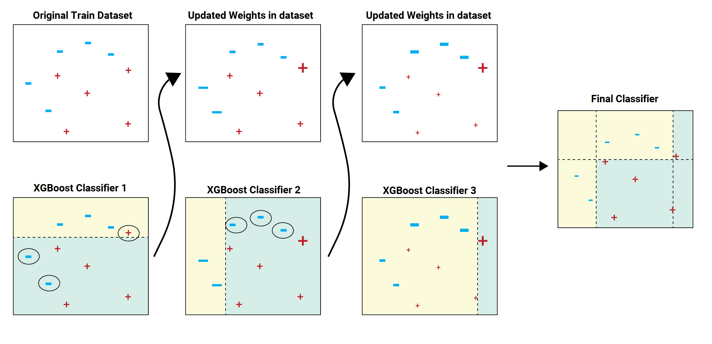

## **Context**

Manufacturing process feature selection and categorization

## **Content**
Abstract: Data from a semi-conductor manufacturing process

*  Data Set Characteristics: Multivariate
*  Number of Instances: 1567
*  Area: Computer
*  Attribute Characteristics: Real
*  Number of Attributes: 591
*  Date Donated: 2008-11-19
*  Associated Tasks: Classification, Causal-Discovery
*  Missing Values? Yes

A complex modern semi-conductor manufacturing process is normally under consistent
surveillance via the monitoring of signals/variables collected from sensors and or
process measurement points. However, not all of these signals are equally valuable
in a specific monitoring system. The measured signals contain a combination of
useful information, irrelevant information as well as noise. It is often the case
that useful information is buried in the latter two. Engineers typically have a
much larger number of signals than are actually required. If we consider each type
of signal as a feature, then feature selection may be applied to identify the most
relevant signals. The Process Engineers may then use these signals to determine key
factors contributing to yield excursions downstream in the process. This will
enable an increase in process throughput, decreased time to learning and reduce the
per unit production costs.

To enhance current business improvement techniques the application of feature
selection as an intelligent systems technique is being investigated.

The dataset presented in this case represents a selection of such features where
each example represents a single production entity with associated measured
features and the labels represent a simple pass/fail yield for in house line
testing, figure 2, and associated date time stamp. Where .1 corresponds to a pass
and 1 corresponds to a fail and the data time stamp is for that specific test
point.

Using feature selection techniques it is desired to rank features according to
their impact on the overall yield for the product, causal relationships may also be
considered with a view to identifying the key features.

Results may be submitted in terms of feature relevance for predictability using
error rates as our evaluation metrics. It is suggested that cross validation be
applied to generate these results. Some baseline results are shown below for basic
feature selection techniques using a simple kernel ridge classifier and 10 fold
cross validation.

Baseline Results: Pre-processing objects were applied to the dataset simply to
standardize the data and remove the constant features and then a number of
different feature selection objects selecting 40 highest ranked features were
applied with a simple classifier to achieve some initial results. 10 fold cross
validation was used and the balanced error rate (*BER) generated as our initial
performance metric to help investigate this dataset.
## **Technical**

### Processing imbalace

1. Under Sampling
    Undersampling refers to a group of techniques designed to balance the class distribution for a classification dataset that has a skewed class distribution.

    Example : We have data with 1000 product passed and 200 product failed. We will get random about 200 product passed in 1000 product for trainning 

    
2. Over Sampling
    * 2.1 Using SMOTE
      * SMOTE works by selecting examples that are close in the feature space, drawing a line between the examples in the feature space and drawing a new sample at a point along that line.
    
      * Specifically, a random example from the minority class is first chosen. Then k of the nearest neighbors for that example are found (typically k=5). A randomly selected neighbor is chosen and a synthetic example is created at a randomly selected point between the two examples in feature space.

    
    
    * 2.2 SVM for SMOTE
    
    

### XGBOOST
    
The XGBoost or Extreme Gradient Boosting algorithm is a decision tree based machine learning algorithm which uses a process called boosting to help improve performance. Since it’s introduction, it’s become of one of the most effective machine learning algorithms and regularly produces results that outperform most other algorithms, such as logistic regression, the random forest model and regular decision trees.

Link data : https://www.kaggle.com/datasets/paresh2047/uci-semcom